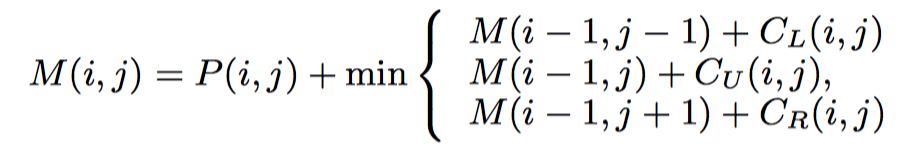
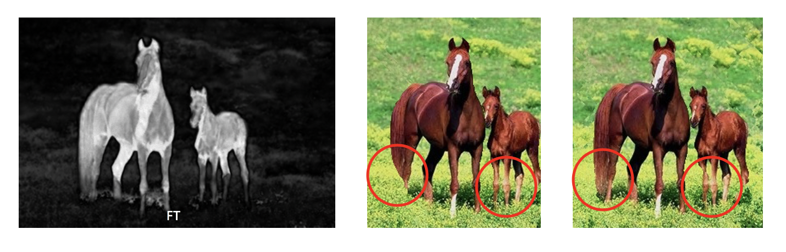
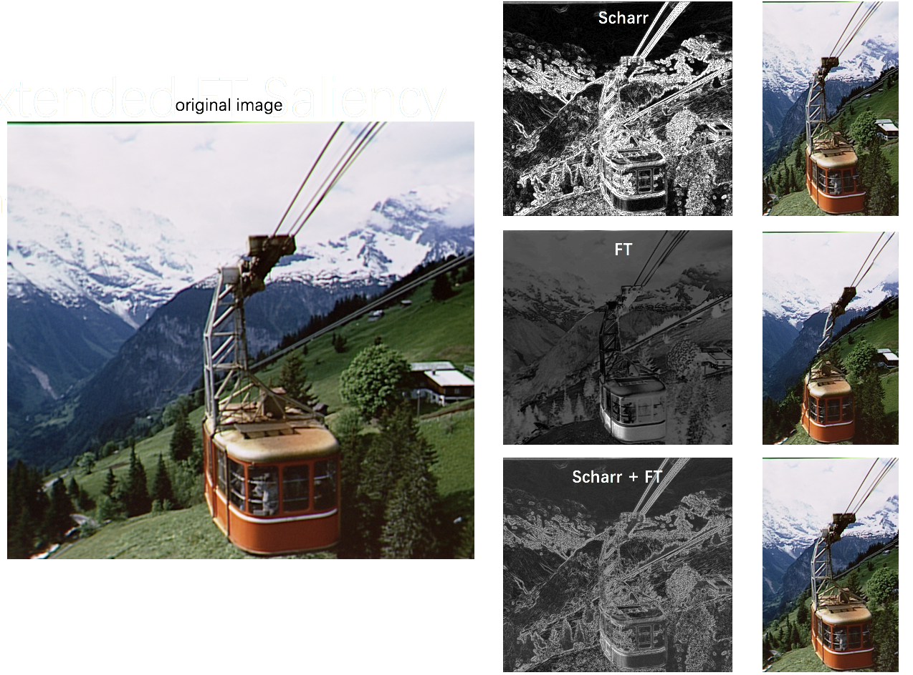

# Seam Carving - energy functions

Dicussion on different energy functions based on C++ seam carving implementation from https://github.com/davidshower/seam-carving.


## 使用

(for Mac)

```
g++ seam-carving.cpp -o seam-carving $(pkg-config --cflags --libs opencv) -std=c++11
```

```
./seam-carving
```

在`seam-carving.cpp` 中，可以调整的参数：

   - 使用的能量函数
   - 是否使用forward energy
   - 是否输入深度图
   - 是否保存结果


以下讨论以将图片宽度裁剪至50%或60%为例。


## 利用局部信息的能量函数

#### 1. 不同梯度算子

对同样大小的卷积核，不同梯度算子本质是考察每个像素和它周围像素和它周围卷积核范围内的像素的差值，只是比重有所不同。测试sobel、scharr、laplacian三种算子，效果差别不大，其中scharr算子更精细一些。


#### 2. 图像局部熵值

对于一个灰度图像I，设它灰度值为i的点共有pi个，则整幅图像的熵值定义为


对图中每个点，取图像周围一个窗口（window），对窗口内的子图求熵值，即得到这点的局部熵值。

以下取窗口为9\*9的正方形，对比梯度和局部熵值方法；梯度一般比较稳定，有时局部熵值略好（如下图第一行）


#### 3. 一个延伸：forward energy

[2]中提出了一个称作forward energy的优化，考虑的是删去一条seam后，之前不相邻的点相邻，增加的额外能量；forward energy意在选取一条本身能量值与删去它之后增加的额外能量之和最小的seam。考虑三种新邻居的产生方式：


相应的，由新相邻的边（上图红边）产生的新增能量依次为（边缘的点特殊处理，但不能简单处理为0，这样找seam时会偏向边缘部分）：


将它累加到动态规划递推方程中：



在大多情况下forward energy可以避免粗糙的边缘，得到更整齐、更周正的结果：


对不同能量定义方式，也可以相应定义不同的forward energy。


#### 4. 总结

1）梯度及其forward energy速度都很快，局部熵值较慢。可能的改进是设置局部熵值直方图统计中的每个bin的大小，视灰度值足够接近的像素为相同像素；

2）梯度、局部熵值都是直接在灰度图上作用，没有有效地利用图像的颜色信息；对于局部熵值也许可以延伸到统计RGB三个通道的255\*3种像素值上（或者其他颜色空间），但较小的window（比如9\*9的window，一共只有81个像素点）统计信息意义不大，较大的window会使能量图信息更加模糊（可以比对`results` 里5\*5的window和9\*9的window得到的局部熵值能量图）；

3）包括梯度、局部熵值在内，这些基于局部信息的能量函数定义方式（其它如梯度+HoG[1]，小波分解[8]等）最大的问题是缺乏整体性。全局性的考虑有visual saliency、segmentation、eye-gaze movement等。


## FT图像显著性检测

#### 1. FT算法

\[3\]的作者提出了一种称作Frequency-tuned的图像显著性检测方法，并在\[4\]中把它应用在Seam Carving中。

算法主要流程如下：


大致思想是首先在Lab空间对图像求一个平均颜色，然后高斯模糊，对模糊后图像中的每个像素求它与这个平均颜色的距离，这个距离就是这一点的显著性值。

这个算法相当简洁，它的主要考虑是 1)高斯模糊后图像中高频信息被去除，而低频信息对人眼更加显著；2)Lab空间在人眼感知上有相对更好的一致性（more perceptually uniform），即颜色数值的变化程度和人眼察觉的变化程度最接近。算法的主要目的是保护图像中较显著的前景；相比于梯度算子，在图像前景颜色比较统一，前景内部梯度很小、会被梯度算子认为不重要时，FT显著图效果最好：


对于在Seam Carving上的应用，算法有明显的局限性：

1）平均颜色一步基于背景占了大部分空间、平均下来更偏向背景的假设；如果图片前景较大（特写之类的），很有可能把前景和背景认反；

2）显著性检测只关注前景显著部分，在模糊后算法几乎舍弃了全部背景的纹理信息（可以看到上面的能量图中，背景部分基本是黑的），如果背景本身有需要保护的纹理/形状，而不是像草地这样比较杂乱、可以任意舍弃的，算法并不会考虑到；另外，模糊后也会出现一部分前景物体的边缘和背景融合；

3）仍然应该考虑每个像素和它周围像素的关系等空间特征。


#### 2. 一些延伸

##### a.更新或不更新能量图

在裁掉每条seam后是否重新计算能量图。FT算法基于背景（非显著部分）占大部分空间的假设，裁掉Seam后背景占比越来越小，显著性检测也就越来越不精确，理论上不更新能量图是更好的做法（梯度、熵值等方法则相反，更新能量图更好）。因此时间上，由于FT显著性图只需计算一次，使用FT显著图的Seam Carving几乎是即时的。

更新与不更新的对比：




##### b.FT显著性检测对应的forward energy

\[4\]中也提出了FT显著性检测对应的forward energy：


右侧为forward energy的结果：


##### c.对显著性检测检测到的区域进行扩大

针对FT算法局限性第2点中前景边缘和背景融合的问题，一个简单的方式是对FT算法得到的显著性图中的显著部分进行扩大：


##### d.和梯度结合

针对FT算法局限性第2点和第3点，可以考虑结合FT显著性图和梯度，在梯度之上图像显著区域/前景得到强调，在显著图之上可以靠梯度保护一些边界，这里简单将它们1:1相加（相当于取并集，而相乘相当于取交集）：




## 引入深度图信息

另一个角度是加入深度图信息\[5\]\[6\]。深度图一般由相机直接得到，是一个包含图中物体的深度/距相机距离的信息的灰度图像，天然地给出了图像中主要物体的空间分布。如果图像中包含很多物体，而显著性检测只关注其中最突出的那个，其他物体就会被忽视（FT算法局限性第2点，“背景”几乎被完全抛弃），可以通过分析深度图，决定“分配”给其它物体多少比重。如果图像只有一个主要的前景和一个主要的背景，深度图的直方图分布会比较分散，而如果图片中物体层次比较多，深度图的直方图分布会比较紧凑、均匀，可以分析深度图的分散程度决定FT显著性检测与深度图在最终能量图中的比重，再添加梯度强调边缘。分析图像的分散程度有多种方式，如直接求它的标准差。\[5\]\[6\]中有更复杂的求分散程度的方式。

在我找到的带深度图的数据中，没有效果特别显著的；图片本身信息密集，似乎scale是保全形态最完整的：


在显著性检测失效时，深度图可以提供一定程度的补救：


深度图本身信息丰富，应该有更多方法把它应用到Seam Carving中。然而这种方式需要用户提供深度图（由单个图像得到深度信息是另一个更复杂的问题了），可能不太能应用到实际中；如果只需要分散程度的话，也许可以尝试其它聚类算法。


## 我的工作

代码`seam-carving.cpp` 基于https://github.com/davidshower/seam-carving中Seam Carving的基础实现（`seam-carving_original.cpp` ）。

我的工作：

1. 实现了以下能量函数：

   1）梯度，Sobel算子、Scharr算子、Laplacian算子

   2）图像局部熵值

   3）FT显著性检测，及其延伸

   4）带深度图的能量函数

   5）以上能量函数结合

2. 实现了梯度算子、FT显著性检测对应的forward energy

3. 比较讨论


## references

[1] Shai Avidan and Ariel Shamir, “Seam carving for contentaware image resizing,” ACM Transactions on Graphics (SIGGRAPH), vol. 26, no. 3, pp. 10, July 2007.

[2] Michael Rubinstein, Ariel Shamir, and Shai Avidan, “Improved seam carving for video retargeting,” ACM Transactions on Graphics (SIGGRAPH), vol. 27, 2008.

[3] Achanta, Radhakrishna, et al. Frequency-tuned salient region detection, in:CVPR 2009. IEEE Conference on Computer Vision and Pattern Recognition, 2009. IEEE, 2009.

[4] Achanta, Radhakrishna, Sabine Susstrunk. Saliency detection for contentaware image resizing, in: Sixteenth IEEE International Conference on Image Processing (ICIP), 2009. IEEE, 2009.

[5] Chen Y, Pan Y, Song M, et al. Improved seam carving combining with 3D saliency for image retargeting[J]. Neurocomputing, 2015, 151: 645-653.

[6] F. Shafieyan, N. Karimi, B. Mirmahboub, S. Samavi, and S. Shirani, “Image retargeting using depth assisted saliency map,” Signal Process. Image Commun., vol. 50, pp. 34–43, Feb. 2017.

[7] Rubinstein M , Gutierrez R , Sorkine R , et al. A Comparative Study of Image Retargeting[J]. ACM Transactions on Graphics, 2010, 29(6CD):p.160.1-160.9.

[8] Jong-Woo Han, Kang-Sun Choi, Tae-Shick Wang, Sung-Hyun Cheon and Sung-Jea Ko, "Improved seam carving using a modified energy function based on wavelet decomposition," *2009 IEEE 13th International Symposium on Consumer Electronics*, Kyoto, 2009, pp. 38-41.


其它参考资料：

1. https://blog.csdn.net/wangyaninglm/article/details/44020489
2. https://blog.csdn.net/marleylee/article/details/78813630
3. 部分测试图片来源[7]，带深度图的测试图片来源http://vision.middlebury.edu/stereo/data/


